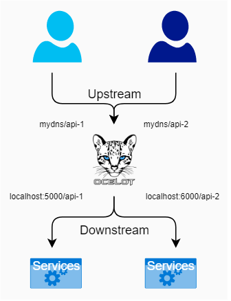

# .NET Ocelot API Gateway 運用與微服務架構範例專案

此專案為 .NET Ocelot API Gateway 運用與微服務架構範例。

本專案基於以下前置調研規劃與設計：

+ [.NET Core 伺服器專案](https://github.com/eastmoon/infra-dotnet-webapi)
+ [.NET Core WebAPI 驗證與授權範例專案](https://github.com/eastmoon/research-dotnet-auth-webapi-project)

## 專案架構


+ 一個 Ocelot 專案
+ 一個 .NET Authentication 專案
    - [auth](./app/auth)
+ 兩個 .NET WebAPI 專案
    - [kernel](./app/kernel)
    - [utils](./app/utils)

詳細設定方式參考[專案建置與操作](./doc/ocelot-project-design.md)文件。

## Ocelot

+ [Ocelot Bigpicture](https://ocelot.readthedocs.io/en/latest/introduction/bigpicture.html)

Ocelot 是對使用 .NET 運作的微服務或服務導向架構，提供一個統一系統入口點；其可配合任何使用 HTTP(S) 協定的服務，並運行於支援 ASP.NET Core 的平台。

若從 .NET 架構來看，Ocelot 本身是個中間件 ( middlewares )，其作用是將 HttpRequest 轉換成 HttpRequestMessage 物件，並透過物件將訊息傳遞給下行服務，再將收到的回應以 HttpResponse 物件回應；在此基本運作上，額外設計如下內容：

+ 基礎服務：經由單一服務傳遞 HTTP(S) 協定給下行 ( downstream ) 服務
+ 身分伺服器：驗證經由身分伺服器 ( IdentityServer ) 取得的權杖 ( token )
+ 負載平衡：提供單一路由指向多個下行服務
+ 配合 Consul：以此取得實際服務資訊與驗證

Ocelot 本身亦是個服務，對於 HTTP 狀態回應也包括相關的[錯誤訊息](https://ocelot.readthedocs.io/en/latest/features/errorcodes.html)規劃。

### 配置設定

+ [Ocelot Configuration](https://ocelot.readthedocs.io/en/latest/features/configuration.html)

Ocelot 的主要設定是來自於 ```ocelot.json``` 檔案，其設定是在 ```ocelot/Service/Program.cs``` 中的設定載入並在服務設定 ```AddOcelot``` 時添加進去。

而設定檔 ```ocelot.json``` 主要有兩段設定：

+ Routes 為路由設定，由於告知 Ocelot 如何處理每個上行 ( upstream ) 需求
+ GlobalConfiguration 是全體設定，用來規劃全部路由的共通設定

Ocelot 的設定檔案載入方式可採用以下方式：

+ 單一個 ```ocelot.json```
    - 配合單檔可以動態修改設定檔後，觸發[變更設定自動載入](https://ocelot.readthedocs.io/en/latest/features/configuration.html#reload-json-config-on-change)
+ 依據[環境參數載入](https://ocelot.readthedocs.io/en/latest/features/configuration.html#multiple-environments)載入設定檔案
+ 多個檔案整合 ```ocelot.([a-zA-Z0-9]*).json``` 與 ```ocelot.global.json``` ( 參考文獻 [Merging Configuration Files](https://ocelot.readthedocs.io/en/latest/features/configuration.html#merging-configuration-files) )
+ 讀取自 Consul 伺服器 ( 參考文獻 [Store Configuration in Consul](https://ocelot.readthedocs.io/en/latest/features/configuration.html#store-configuration-in-consul) )

### 路由

+ [Ocelot Routing](https://ocelot.readthedocs.io/en/latest/features/routing.html)



對 Ocelot 來說，從用戶來的 HttpRequest 是上行 ( Upstream ) 內容，要傳遞的目標服務是下行 ( Downstream ) 內容，因此，其任一路由設定規則如下：

```
{
  "Routes": [
    {
      "UpstreamPathTemplate": "/posts/{postId}",
      "UpstreamHttpMethod": [ "Put", "Delete" ],
      "DownstreamPathTemplate": "/api/posts/{postId}",
      "DownstreamScheme": "https",
      "DownstreamHostAndPorts": [
        { "Host": "localhost", "Port": 80 }
      ]
    }
  ]
}
```
> 所有路由規則一律放到 Routes 矩陣中

其各項設定方述如下：

+ UpstreamPathTemplate：Ocelot 監測的路由，並[標記變數符號](https://ocelot.readthedocs.io/en/latest/features/routing.html#placeholders)，供給下行組合路由
+ UpstreamHttpMethod：Ocelot 監測的路由使用何種 Http 方式
    - 透過此設定可以規劃相同路由不同方式，並指向不同的下行服務
+ DownstreamPathTemplate：Ocelot 傳遞目標服務的路由，可使用上行的[標記變數符號](https://ocelot.readthedocs.io/en/latest/features/routing.html#placeholders)來組合路徑
+ DownstreamScheme：Ocelot 傳遞目標服務的協定，在某些情況下上行會試 HTTPS 但下行為 HTTP
+ DownstreamHostAndPorts：Ocelot 傳遞目標服務的網址 ( 域名 ) 與連結埠

其他設定：

+ ```"RouteIsCaseSensitive": true```：指定上下行路由匹配會區分大小寫，亦即大小寫必須完全匹配
+ ```"UpstreamHost": "somedomain.com"```：指定改上行路由，其網址的來源必需為 ```somedomain.com```，亦即是經由 DNS 域名轉址過來的訊息，倘若未設定此項則所有來源皆會進入
    - 此項設定類似 Nginx 的 VirtualHost，以此指定特定域名對應至內部的服務，來達到多個域名指向單一主機，但相同連結埠能進入不同的服務
+ ```"Priority": 0```：指定當前路由設定的優先權，當單一路由可能匹配多個設定時，優先權高的會先被匹配
+ [Query Strings](https://ocelot.readthedocs.io/en/latest/features/routing.html#query-strings)
    - 在 ```UpstreamPathTemplate``` 中可以自 Query Strings 中設定變數符號，並利用在 ```DownstreamPathTemplate``` 中的 Query Strings
+ [Security Options](https://ocelot.readthedocs.io/en/latest/features/routing.html#security-options)
    - 設定允許與阻擋的網址，可以設定單一網址或指定網段

### 負載平衡

+ [Ocelot Load Balancer](https://ocelot.readthedocs.io/en/latest/features/loadbalancer.html)

Ocelot 對每個路由可以設定複數個下行目標服務在 ```DownstreamHostAndPorts``` 並設定 ```LoadBalancerOptions``` 以啟動對此路由處理的[負載平衡](https://aws.amazon.com/tw/what-is/load-balancing/)。

```
{
  "Routes": [
    {
      "UpstreamPathTemplate": "/posts/{postId}",
      "UpstreamHttpMethod": [ "Put", "Delete" ],
      "DownstreamPathTemplate": "/api/posts/{postId}",
      "DownstreamScheme": "https",
      "DownstreamHostAndPorts": [
        { "Host": "10.0.1.10", "Port": 5000 },
        { "Host": "10.0.1.11", "Port": 5000 }
      ],
      "LoadBalancerOptions": {
        "Type": "LeastConnection"
      }
    }
  ]
}
```
> 此範例將路由 ```/posts/{postId}``` 導向 ```/api/posts/{postId}```，其下行服務在 10.0.1.10:5000 和 10.0.1.11:5000，使用負載平衡型態為 LeastConnection

目前實作的負載平衡類型如下：

+ LeastConnection：下行服務中現有請求數最少的服務優先
+ RoundRobin：依序循環將請求交由下行服務處理
+ NoLoadBalancer：將請求交由第一個下行服務處理
+ CookieStickySessions：將 Cookie 資訊粘貼於全部請求

若現有的負載平衡機制不符合使用，可[自行設計負載平衡演算法](https://ocelot.readthedocs.io/en/latest/features/loadbalancer.html#custom-load-balancers)。

## 授權與驗證

+ [Ocelot Administration](https://ocelot.readthedocs.io/en/latest/features/administration.html)
+ [Ocelot Authentication](https://ocelot.readthedocs.io/en/latest/features/authentication.html)
+ [Ocelot Authorization](https://ocelot.readthedocs.io/en/latest/features/authorization.html)

## 服務探索 ( Service Discovery )

+ [Ocelot Service Discovery](https://ocelot.readthedocs.io/en/latest/features/servicediscovery.html)

## 文獻

+ [Ocelot - Github](https://github.com/ThreeMammals/Ocelot)
    - [Ocelot Navigation](https://ocelot.readthedocs.io/en/latest/introduction/gettingstarted.html)
    - [使用 Ocelot 實作 API 閘道](https://learn.microsoft.com/zh-tw/dotnet/architecture/microservices/multi-container-microservice-net-applications/implement-api-gateways-with-ocelot)
+ 教學文章與範例專案
    - [Ocelot-Gateway-Sample - Github](https://github.com/PasinduUmayanga/Ocelot-Gateway-Sample)
