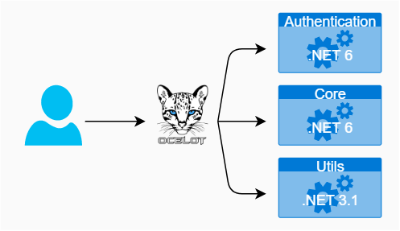

# research-microservice-and-ocelot

This is a microservice infrastructure project run with Ocelot and .NET WebAPI.

## 專案架構



+ 一個 Ocelot 專案
+ 一個 .NET Authentication 專案
    - [auth](./app/auth)
+ 兩個 .NET WebAPI 專案
    - [kernel](./app/kernel)
    - [utils](./app/utils)

詳細設定方式參考[專案建置文件](./doc/ocelot-project-design.md)

## Ocelot

+ [Ocelot Bigpicture](https://ocelot.readthedocs.io/en/latest/introduction/bigpicture.html)

### 設定規劃

+ [Ocelot Configuration](https://ocelot.readthedocs.io/en/latest/features/configuration.html)

Ocelot 的主要設定是來自於 ```ocelot.json``` 檔案，其設定是在 ```ocelot/Service/Program.cs``` 中的設定載入並在服務設定 ```AddOcelot``` 時添加進去。

而設定檔 ```ocelot.json``` 主要有兩段設定：

+ Routes 為路由設定，由於告知 Ocelot 如何處理每個上行 ( upstream ) 需求
+ GlobalConfiguration 是全體設定，用來規劃全部路由的共通設定

Ocelot 的設定檔案載入方式可採用以下方式：

+ 單一個 ```ocelot.json```
    - 配合單檔可以動態修改設定檔後，觸發[變更設定自動載入](https://ocelot.readthedocs.io/en/latest/features/configuration.html#reload-json-config-on-change)
+ 依據[環境參數載入](https://ocelot.readthedocs.io/en/latest/features/configuration.html#multiple-environments)載入設定檔案
+ 多個檔案整合 ```ocelot.([a-zA-Z0-9]*).json``` 與 ```ocelot.global.json``` ( 參考文獻 [Merging Configuration Files](https://ocelot.readthedocs.io/en/latest/features/configuration.html#merging-configuration-files) )
+ 讀取自 Consul 伺服器 ( 參考文獻 [Store Configuration in Consul](https://ocelot.readthedocs.io/en/latest/features/configuration.html#store-configuration-in-consul) )

### 路由

+ [Ocelot Routing](https://ocelot.readthedocs.io/en/latest/features/routing.html)


### 負載平衡

+ [Ocelot Load Balancer](https://ocelot.readthedocs.io/en/latest/features/loadbalancer.html)

## 文獻

+ [Ocelot - Github](https://github.com/ThreeMammals/Ocelot)
    - [Ocelot Navigation](https://ocelot.readthedocs.io/en/latest/introduction/gettingstarted.html)
    - [使用 Ocelot 實作 API 閘道](https://learn.microsoft.com/zh-tw/dotnet/architecture/microservices/multi-container-microservice-net-applications/implement-api-gateways-with-ocelot)
+ 教學文章與範例專案
    - [Ocelot-Gateway-Sample - Github](https://github.com/PasinduUmayanga/Ocelot-Gateway-Sample)
